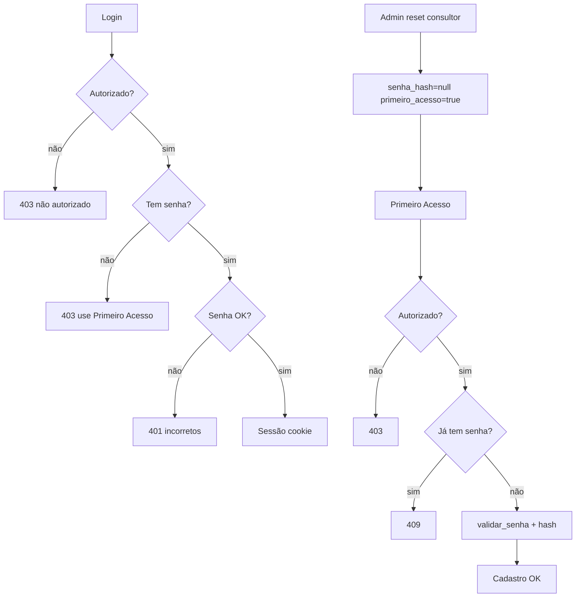

# Autenticação PDF Extreme AI v2

Auth isolada no **servidor onde o v2 roda** (`pdf_extreme_ai_v2/data/auth/`). Não depende do GEP nem de arquivos em outra máquina.

## Fluxos



## GEP vs RAG (nomes)

| GEP | PDF Extreme AI v2 |
|-----|-------------------|
| `admins.json` | `data/auth/admins.json` |
| `usuarios_gep.json` | `data/auth/usuarios_app.json` |
| Streamlit session | Cookie `pdf_extreme_session` (Starlette SessionMiddleware) |

## Deploy SSH

```bash
cd pdf_extreme_ai_v2
cp .env.example .env   # editar SESSION_SECRET, BOOTSTRAP_ADMIN_USER
python scripts/bootstrap_admin.py seu.usuario
cd backend && pip install -r requirements.txt
uvicorn main:app --host 0.0.0.0 --port 8765 --reload
```

1. Abrir frontend → **Primeiro Acesso** com `seu.usuario`
2. **Login** como admin
3. **Usuários** (sidebar) → adicionar consultores
4. Consultor faz Primeiro Acesso na máquina dele

Sincronizar usuários com o GEP é **manual** (copiar listas para `admins.json` / `consultores` se desejado).

## Projetos por utilizador

Cada projeto tem `owner_id` (login). **Admin e consultor** veem apenas projetos em que `owner_id` é o seu utilizador.

Projetos antigos sem `owner_id` não aparecem para ninguém até migração:

```bash
export PDF_EXTREME_AI_ROOT=/home/labfaces/pdf_extreme_ai
python pdf_extreme_ai_v2/scripts/assign_project_owners.py paulo.pmgir
```

Use `--dry-run` para pré-visualizar.

## Credenciais de serviço

`auth/service_credentials.py` — stub Fernet por máquina. **N/A** para Ollama local. Não copiar `.enc` de outro host.

## Segurança

- Senhas: werkzeug `pbkdf2:sha256`
- APIs não retornam `senha_hash`
- Admin não define senha de terceiros; só **reset** (consultores)
- `SESSION_SECRET` obrigatório em produção
- `SESSION_HTTPS_ONLY=true` com HTTPS
