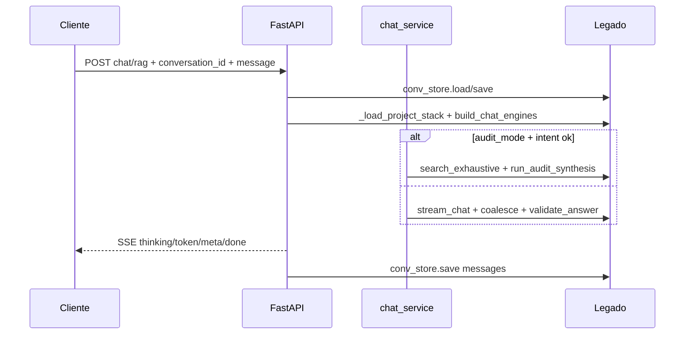

# MIGRATION_MAP — Streamlit → API v2 + React

Mapeamento entre a UI Streamlit atual (`pdf_extreme_ai/app.py`) e a API FastAPI em `pdf_extreme_ai_v2/backend/`.  
**Fonte da verdade de comportamento:** Streamlit existente. **Regra:** paridade antes de simplificar.

---

## 1. Paths e dados compartilhados

| Recurso | Path relativo ao repo (`pdf_extreme_ai/`) | Escopo |
|---------|--------------------------------------------|--------|
| Registry de projetos | `data/projects_registry.json` | Global |
| Dados por projeto | `data/projects/<project_id>/` | Por projeto |
| Uploads PDF | `data/projects/<project_id>/uploads/` | Por projeto |
| Conversas | `data/projects/<project_id>/conversations/<id>.json` | Por projeto |
| Memória do caso | `data/projects/<project_id>/project_memory.md` | Por projeto |
| Memória estruturada | `data/projects/<project_id>/project_memory.json` | Por projeto |
| Entidades NER | `data/projects/<project_id>/entities.json` | Por projeto |
| Grafo cross-doc | `data/projects/<project_id>/cross_doc_graph.json` | Por projeto |
| Índice lexical | `data/lexical/<project_id>.db` | Por projeto |
| Checkpoint ingest | `data/checkpoints/<project_id>.json` | Por projeto |
| Qdrant collection | `proj_<project_id>` (nome em `ProjectRecord`) | Por projeto |
| Qdrant storage | `qdrant_data/` (Docker volume) | Global |
| `.env` | `pdf_extreme_ai/.env` | Config |

### Estratégia v2 (sem reindexar)

- Variável **`PDF_EXTREME_AI_ROOT`**: default `../pdf_extreme_ai` (resolvido a partir de `pdf_extreme_ai_v2/`).
- O backend faz `chdir` ou resolve paths absolutos para esse root antes de importar `project_store`, `ingest_service`, etc.
- **Mesmos** `projects_registry.json`, `projects_data/`, `.lexical_*.db` e coleções Qdrant que o Streamlit usa.
- Rodar Streamlit e API v2 **em paralelo** é suportado; evitar ingest simultâneo no mesmo projeto (mesmo lock GPU que hoje).

---

## 2. `st.session_state` vs persistência

| Chave session_state | Persistido? | Equivalente API / cliente |
|---------------------|-------------|---------------------------|
| `active_project_id` | Registry | `GET/POST` seleção de projeto (header ou path) |
| `messages` | `conversations/*.json` ao salvar | Corpo da conversa + `PATCH` após turno |
| `active_conversation_id` | JSON conversa | Path `conversation_id` |
| `app_workspace` | Não (UI) | Campo `mode` no body do chat: `rag` \| `free` |
| `model_selected_prev` | `ConversationRecord.model_name` parcial | Body `model` |
| `project_rules_input` | `ProjectRecord.global_rules` | `GET/PUT /projects/{id}/rules` |
| `project_memory_input` | `project_memory.md` | `GET/PUT /projects/{id}/memory` |
| `free_use_project_memory` | Não | Body `use_project_memory` (chat free) |
| `audit_mode_ui` | Não | Body `audit_mode` (chat rag) |
| `forced_profile` / strategy | Não | Body `profile`: `automatico` \| `rapido` \| `preciso` \| `pericial` |
| `ingest_running`, `ingest_logs`, `ingest_progress` | Não | SSE ou polling em `POST .../ingest` (fase 2) |
| `last_ingest_per_file` | Não | Response JSON do ingest |
| `proofread_last_result` | Não | Response `POST /proofread` |
| `chat_memory` | Rehidratado de `messages` | Servidor monta `Memory` por request |
| `_pdf_extreme_pending_prompt` | Não | Request HTTP único |
| `model_ready`, `gpu_phase` | Não | Health / status Ollama (fase 2) |
| `selected_doc_ids` | Não | Body em reprocess/delete docs (fase 2) |

---

## 3. Modos de workspace (`app_workspace.py`)

| Modo Streamlit | Label UI | Motor Python | Endpoint v2 | React |
|----------------|----------|--------------|-------------|-------|
| `rag` | Autos (RAG) | `CondensePlusContextChatEngine` + `HybridRetriever` | `POST .../chat/rag` SSE | `ModeTabs` + `ChatPanel` |
| `free` | Chat livre | `SimpleChatEngine` | `POST .../chat/free` SSE | Idem + checkbox memória |
| `proofread` | Corretor | `proofread_service` | `POST /proofread` | `ProofreadPanel` |

---

## 4. Painel esquerdo — Projetos e base

| Tela / ação Streamlit | Função Python | Endpoint API v2 | Componente React (futuro) |
|----------------------|---------------|-----------------|---------------------------|
| Listar projetos | `ProjectStore.list_projects` | `GET /projects` | `ProjectSidebar` |
| Selecionar projeto | `active_project_id` | Path `{project_id}` em rotas | `ProjectSelector` |
| Criar projeto | `ProjectStore.create_project` | `POST /projects` `{name}` | Botão novo projeto |
| Excluir projeto | `delete_project` + `_cleanup_project_assets` | `DELETE /projects/{id}` | Confirmação modal |
| Caption coleção/lexical | `ProjectRecord` fields | `GET /projects/{id}` | Detalhe projeto |
| Upload PDF | `_persist_uploaded_files` | `POST /projects/{id}/ingest` multipart | `DocumentUpload` |
| Auto-ingest toggle | `auto_ingest_enabled` | Cliente chama ingest após upload | Opção UI |
| Rebuild checkbox | `run_ingest(rebuild=True)` | Query `?rebuild=true` | Checkbox destrutivo |
| Ingerir manual | `_run_ingest_for_paths` | Idem ingest | Botão ingerir |
| Logs ingest | `progress_callback` | Fase 2: SSE `ingest/events` | Log panel |
| Alertas qualidade | `_render_ingest_quality_warnings` | Response `per_file` no ingest | Toast / lista |
| Lista documentos | `ProjectRecord.documents` | `GET /projects/{id}/documents` | Aba Documentos |
| Reprocessar selecionados | `_run_ingest_for_paths` | `POST /projects/{id}/ingest/reprocess` | Fase 2 |
| Remover selecionados | `_remove_docs_from_indexes` + `remove_documents` | `DELETE /projects/{id}/documents` | Fase 2 |
| Regras globais | `set_global_rules` | `GET/PUT /projects/{id}/rules` | Aba Regras |
| Memória do caso | `project_memory_store.save/load` | `GET/PUT /projects/{id}/memory` | Aba Memória |
| Timeline entidades | `load_entities` | `GET /projects/{id}/entities` | Aba Memória / Timeline |
| Forçar OCR | `ENABLE_OCR` env temporário | `POST ingest?force_ocr=true` | Fase 2 |

**Nota:** `ProjectStore.delete_project` foi adicionado ao `core/project_store.py` e é usado tanto pela API v2 quanto pela UI Streamlit. A lógica de cleanup de assets (Qdrant, SQLite, uploads) permanece em `backend/services/project_cleanup.py`.

---

## 5. Painel direito — Modelo, conversas, chat

| Tela / ação Streamlit | Função Python | Endpoint API v2 | Componente React (futuro) |
|----------------------|---------------|-----------------|---------------------------|
| Select modelo | `OLLAMA_MODELS` | `GET /config/models` | `ModelSelect` (fase 2) |
| Modo de uso (3 vias) | `app_workspace` | Campo `mode` no chat | `ModeTabs` header |
| Estratégia RAG | `forced_profile` | Body `profile` | Expander Config RAG |
| Modo auditoria | `should_run_audit_synthesis` | Body `audit_mode` | Checkbox RAG only |
| Chat livre + memória | `free_use_project_memory` | Body `use_project_memory` | Checkbox |
| Listar conversas | `conv_store.list_conversations` | `GET /projects/{id}/conversations` | `ConversationList` |
| Nova conversa | `conv_store.create` | `POST /projects/{id}/conversations` | Botão nova |
| Abrir conversa | load JSON → `messages` | `GET /projects/{id}/conversations/{cid}` | Clique na lista |
| Renomear | `conv_store.rename` | `PATCH .../conversations/{cid}` `{title}` | Inline edit |
| Excluir conversa | `conv_store.delete` | `DELETE .../conversations/{cid}` | Botão excluir |
| Enviar mensagem RAG | `_setup_chat_engines` + stream | `POST .../chat/rag` SSE | `ChatInput` |
| Enviar mensagem free | `build_free_chat_engines` + stream | `POST .../chat/free` SSE | Idem |
| Thinking expander | `get_captured_thinking` / stream | SSE `event: thinking` | `ThinkingBlock` |
| Telemetria caption | `last_diagnostics` | SSE `event: meta` | Rodapé mensagem |
| Trechos recuperados | `retrieved_chunks_ui` | SSE `event: meta` `retrieved_chunks` | Expander por msg |
| Exportar MD | `_build_assistant_export_md` | `GET .../export` ou cliente | Fase 2 |
| Validacao retry | `validate_answer` + fallback | Transparente no stream (mesmo fluxo) | — |

---

## 6. Corretor (modo proofread)

| Streamlit | Python | API v2 | React |
|-----------|--------|--------|-------|
| Text area + Corrigir | `run_proofread` + `build_highlighted_html` | `POST /proofread` | Editor + preview HTML |
| Download MD/txt | `proofread_ui` | Cliente gera arquivo | Botões download |

Body proposto:

```json
{
  "text": "...",
  "model": "gemma4:e4b",
  "max_chars": 12000
}
```

Response: `{ "corrected_text", "changes", "source_text", "highlighted_html", "error?", "raw_fallback?" }`

React: `ProofreadPanel.tsx` — aba header **Corretor**.

---

## 7. Fluxo de chat RAG (paridade)



Módulos legado tocados (import, sem cópia):

- `retrieval_pipeline.HybridRetriever`
- `query_planner.plan_query`
- `query_expansion.expand_query`
- `exhaustive_retrieval`, `audit_synthesis`
- `answer_validator`
- `retrieved_chunks_ui.nodes_to_serializable`
- `chat_response_utils.coalesce_assistant_reply`
- `llama_index_stream_queue_patch.apply()` (startup API)

---

## 8. Endpoints (Fase 1 + Lote 2)

| Método | Path | Status |
|--------|------|--------|
| GET | `/health` | OK |
| GET | `/config` | Lote 2 — limites ingest, modelos |
| GET | `/projects` | OK |
| POST | `/projects` | OK |
| GET | `/projects/{id}` | OK |
| DELETE | `/projects/{id}` | OK |
| GET | `/projects/{id}/rules` | Lote 2 |
| PATCH | `/projects/{id}/rules` | Lote 2 |
| GET | `/projects/{id}/memory` | Lote 2 |
| PUT | `/projects/{id}/memory` | Lote 2 |
| GET | `/projects/{id}/documents` | Lote 2 |
| DELETE | `/projects/{id}/documents/{file_id}` | Lote 2 |
| POST | `/projects/{id}/documents/{file_id}/reprocess` | Lote 2 |
| GET | `/projects/{id}/conversations` | OK |
| POST | `/projects/{id}/conversations` | OK |
| GET/PATCH/DELETE | `.../conversations/{cid}` | OK |
| POST | `/projects/{id}/ingest` | OK (+ validação 400/413) |
| POST | `/projects/{id}/ingest/stream` | Lote 2 SSE progresso |
| POST | `/projects/{id}/chat/rag` | OK SSE |
| POST | `/projects/{id}/chat/free` | OK SSE |
| POST | `/proofread` | OK (+ `highlighted_html`) |
| POST | `/export/markdown` | Lote 2 (opcional; UI exporta no cliente) |

---

## 9. Endpoints fase futura

| Método | Path | Motivo adiar |
|--------|------|--------------|
| GET | `/projects/{id}/status` | GPU / Ollama / index counts |
| GET | `/projects/{id}/entities` | Timeline NER |

---

## 10. Layout UX alvo (React — fase futura)

```
┌──────────────┬─────────────────┬────────────────────────────────┐
│ Projetos     │ Conversas       │  [Autos RAG | Chat livre | Corretor] │
│ + novo       │ + nova          │  Mensagens + thinking + trechos      │
│              │                 │  Input                               │
├──────────────┴─────────────────┴────────────────────────────────┤
│ Abas projeto: Documentos | Memória | Regras | Config RAG          │
└───────────────────────────────────────────────────────────────────┘
```

---

## 11. Bloqueios / divergências conhecidas

| Item | Ação v2 |
|------|---------|
| `delete_project` ausente no store | Implementado no backend v2 apenas |
| GPU lock ingest (`gpu_runtime`) | API deve checar `is_ingest_active()` antes do chat (fase 2) |
| `st.cache_resource` stack/reranker | Cache em processo no `StackManager` v2 |
| Reranker falha | Mesmo fallback sem reranker que `app.py` |

---

## 12. Testes de paridade

| Teste legado | Espelho v2 |
|--------------|------------|
| `tests/test_proofread_*.py` | `pdf_extreme_ai_v2/tests/test_api_smoke.py` |
| `tests/test_query_planner.py` | Import via `PDF_EXTREME_AI_ROOT` |
| `tests/test_answer_validator.py` | Idem |

Smoke manual Fase 1:

1. `GET /projects` == lista no Streamlit  
2. `POST /proofread` com parágrafo de teste  
3. `POST .../chat/rag` em projeto já indexado com pergunta curta  
4. `POST .../chat/free` mesma pergunta sem RAG  

---

*Documento gerado na Fase 0 do initiative pdf_extreme_ai_v2.*
