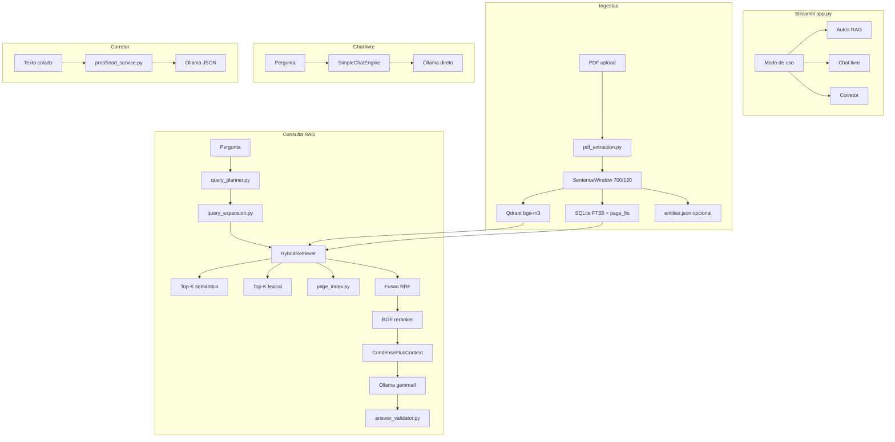
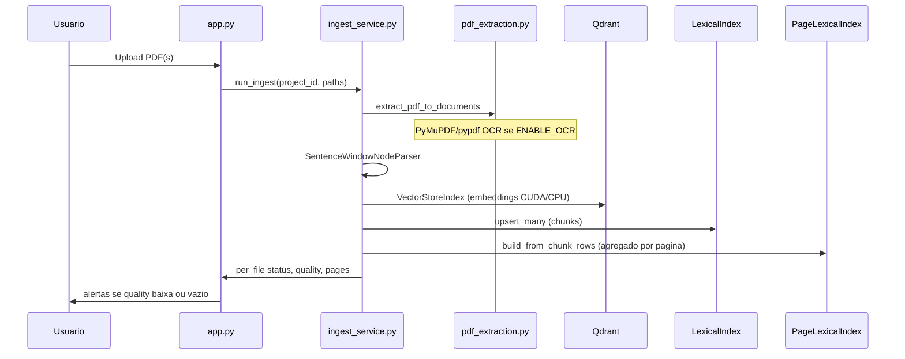
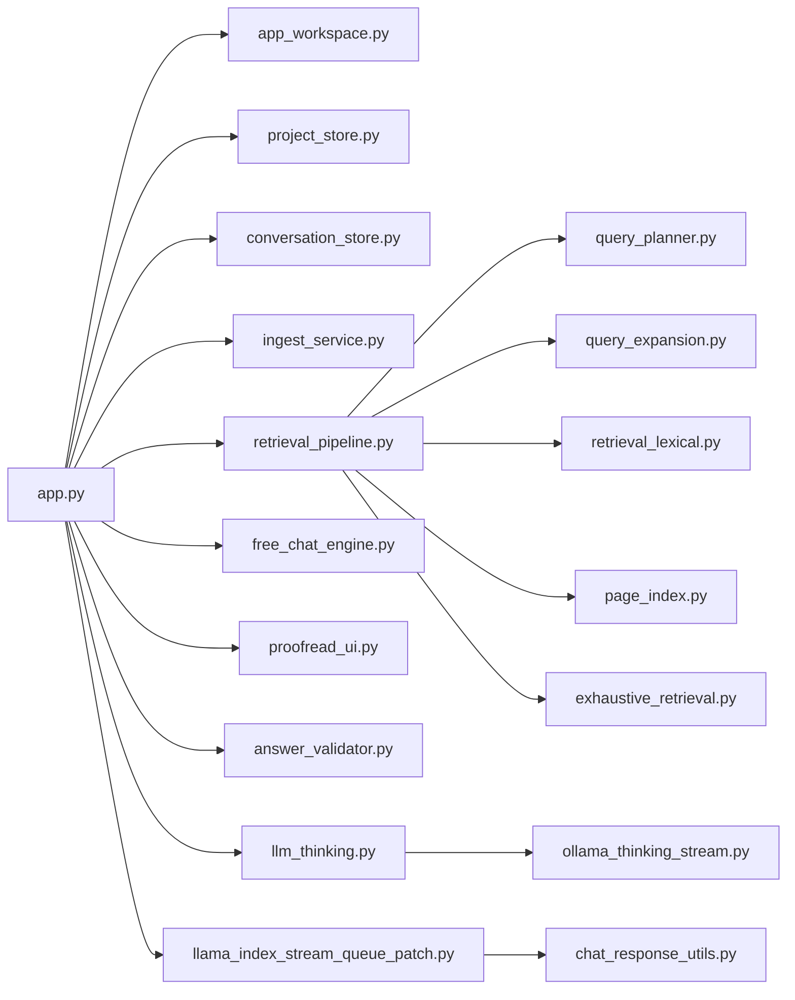

# PDF Extreme AI — Visão geral do projeto

Documento de referência sobre **o que o sistema é**, **como opera** e **quais componentes existem**. Complementa o [README.md](README.md) (início rápido) e o [OPERATIONS.md](OPERATIONS.md) (operação e variáveis de ambiente).

---

## 1. Propósito

**PDF Extreme AI** é um assistente para **autos e PDFs jurídicos** que combina:

- Interface web principal em **React + FastAPI**, com UI **Streamlit** legada (`legacy/app.py`);
- **RAG** (Retrieval-Augmented Generation) híbrido: busca semântica (vetores) + busca lexical (FTS5);
- LLM local via **Ollama** (modelos `gemma4:26b` e `gemma4:e4b`);
- Reranker **BGE** (cross-encoder) para refinar trechos antes da resposta;
- Múltiplos **projetos** isolados (cada um com sua coleção Qdrant, índice lexical e uploads).

O sistema foi desenhado para perícia e análise processual: citações por página/arquivo, recall lexical em termos críticos, validação de respostas e modos distintos de uso (RAG, conversa livre, corretor ortográfico).

**Limite honesto:** o RAG usa top-k por pergunta; não garante leitura integral de todos os PDFs num único turno. Para varredura ampla de um termo existe o **modo auditoria**; para PDFs escaneados, OCR opcional (Fase 3).

---

## 2. Stack tecnológico

| Camada | Tecnologia |
|--------|------------|
| UI | React + FastAPI (principal); Streamlit (`legacy/app.py`) legado |
| Orquestração RAG | LlamaIndex (`CondensePlusContextChatEngine`, `VectorStoreIndex`) |
| Vetores | Qdrant + embeddings **BGE-M3** (HuggingFace) |
| Lexical | SQLite **FTS5** (`lexical_fts`, `page_fts`) |
| LLM | Ollama (`OllamaThinkingStream` com suporte a *thinking*) |
| Reranker | `BAAI/bge-reranker-base` (CPU ou CUDA) |
| PDF | PyMuPDF / pypdf; OCR opcional (Tesseract) |
| Persistência | `data/projects_registry.json`, `data/projects/<project_id>/`, `data/checkpoints/<project_id>.json` |

---

## 3. Arquitetura em alto nível



---

## 4. Três modos de uso (painel direito)

O seletor **Modo de uso** é independente de haver PDFs indexados:

| Modo | Motor | Usa PDFs? | Thinking | Descrição |
|------|--------|-----------|----------|-----------|
| **Autos (RAG)** | `CondensePlusContextChatEngine` + `HybridRetriever` | Sim | Sim (`OLLAMA_THINKING`) | Perguntas sobre documentos; prompts jurídicos; citações; telemetria |
| **Chat livre** | `SimpleChatEngine` (`free_chat_engine.py`) | Não | Sim | Conversa com LLM sem busca nos autos |
| **Corretor** | `proofread_service.py` (chamada direta ao LLM) | Não | Não | Colar texto; correção ortográfica/gramatical com destaques |

### 4.1 Autos (RAG)

1. Usuário envia pergunta → `query_planner.py` escolhe perfil (`rapido` / `preciso` / `pericial`) e *intent* (literal, forense, página, auditoria, etc.).
2. `query_expansion.py` pode enriquecer a query (léxico forense + memória do caso).
3. `HybridRetriever` busca em paralelo:
   - **Semântico:** Qdrant (top-k do perfil);
   - **Lexical:** `LexicalIndex` (FTS5);
   - **Por página:** `PageLexicalIndex` quando há `fls.` / faixa de páginas.
4. Fusão **RRF** (Reciprocal Rank Fusion) dos rankings.
5. Pós-processadores: janela de contexto (`window`), nomes legíveis (`display_name`), **reranker**.
6. `CondensePlusContextChatEngine` condensa histórico + monta prompt com trechos.
7. Ollama gera resposta; `answer_validator.py` pode pedir **retry** se a resposta negar menções que o FTS encontrou.
8. UI mostra **Trechos usados nesta resposta**, telemetria (`fused`, `literal_hits`, etc.) e exportação Markdown.

**Modo auditoria** (checkbox, só no RAG): varredura FTS paginada (`exhaustive_retrieval.py`) + síntese em lotes (`audit_synthesis.py`) para perguntas literais/exaustivas — **não** para “resumo do caso”.

### 4.2 Chat livre

- Não instancia retriever nem Qdrant na consulta.
- Prompt de sistema em `build_free_chat_system_prompt` (`rag_prompts.py`).
- Memória do caso **opcional** (checkbox desligado por padrão).
- Stream com thinking via `ThinkingCaptureLLM` + patch em `llama_index_stream_queue_patch.py` (mensagens multi-bloco).

### 4.3 Corretor ortográfico

- `text_area` + botão **Corrigir texto**.
- LLM responde em **JSON** (`corrected_text` + lista `changes`).
- UI renderiza HTML: correções em **negrito + fundo amarelo + texto preto**; supressões destacam palavras vizinhas em amarelo.
- Texto colado **não** é indexado.

---

## 5. Fluxo de ingestão de PDFs



**Arquivo central:** `ingest_service.py`

- Estratégia padrão: `sentence_window` (chunk ~700 tokens, overlap 120, janela de vizinhos).
- Checkpoint: `.ingest_checkpoint_<project_id>.json`.
- Pode pausar Ollama antes da ingest (`INGEST_PAUSE_OLLAMA`) para liberar VRAM ao embedding.
- `per_file`: `status` (`indexed`, `empty`, `empty_chunks`, `error`), `quality`, `pages`, `chunks`.

---

## 6. Pipeline de recuperação (RAG)

**Arquivo central:** `retrieval_pipeline.py` — classe `HybridRetriever`

| Etapa | Descrição |
|-------|-----------|
| Planejamento | `query_planner.py` → `QueryPlan` (perfil, intent, página, faixa, arquivo, seção) |
| Expansão | `query_expansion.py` (termos forenses + memória) |
| Busca semântica | `VectorStoreIndex.as_retriever` |
| Busca lexical | `retrieval_lexical.py` → `LexicalIndex.search` / `search_paginated` |
| Índice por página | `page_index.py` → `page_fts` |
| Auditoria exaustiva | `exhaustive_retrieval.py` + `audit_synthesis.py` |
| Fusão | RRF (`RRF_K = 60`) |
| Filtros | Página, faixa, hint de `source_file`, boost por seção |
| Saída | `last_retrieved_nodes`, `last_diagnostics` (telemetria na UI) |

**Perfis** (`runtime_config.py`):

| Perfil | Uso | Validação |
|--------|-----|-----------|
| `rapido` | Perguntas curtas | `none` |
| `preciso` | Padrão recomendado | `light` (+ retry se negar menção com hits lexical) |
| `pericial` | Exaustivo / forense | `strong` |

---

## 7. Validação de respostas

**Arquivo:** `answer_validator.py`

- Verifica citações `[arquivo, pag]` em respostas RAG.
- Detecta respostas que dizem “não há menção” quando `literal_count > 0`.
- Perfil **preciso**: retry automático via `fallback_chat_engine` (sem reranker).
- Perfil **pericial**: critérios mais rígidos (cobertura, total de ocorrências, faixa de páginas).

---

## 8. LLM, thinking e streaming

| Módulo | Função |
|--------|--------|
| `ollama_thinking_stream.py` | Stream Ollama que não descarta chunks só de thinking |
| `llm_thinking.py` | `ThinkingCaptureLLM` — wrapper que acumula raciocínio |
| `llama_index_stream_queue_patch.py` | Enfileira deltas vazios; grava histórico com `assign_assistant_text_to_message` (multi-block) |
| `chat_response_utils.py` | Evita `"Empty Response"`; extrai texto de `TextBlock` vs `ThinkingBlock` |

Na UI: expander **Thinking do modelo** (recolhido após a resposta).

---

## 9. Mapa de módulos Python

### 9.1 Interface e orquestração

| Arquivo | Responsabilidade |
|---------|------------------|
| `app.py` | UI Streamlit completa: projetos, ingest, chat, export, três modos |
| `app_workspace.py` | Labels dos modos; regra do modo auditoria |
| `project_store.py` | CRUD de projetos em `projects_registry.json` |
| `conversation_store.py` | Conversas salvas em JSON por projeto |
| `display_name.py` | Nomes legíveis de PDFs na UI e citações |

### 9.2 RAG e recuperação

| Arquivo | Responsabilidade |
|---------|------------------|
| `retrieval_pipeline.py` | `HybridRetriever`, RRF, diagnósticos |
| `retrieval_lexical.py` | FTS5 chunk-level + `search_paginated` |
| `page_index.py` | FTS agregado por `(source_file, page)` |
| `query_planner.py` | Intents e perfis por pergunta |
| `query_expansion.py` | Expansão leve de query |
| `exhaustive_retrieval.py` | Varredura lexical ampla |
| `audit_synthesis.py` | Map-reduce para muitas páginas |
| `empty_retriever.py` | Retriever vazio (legado / modo geral antigo) |
| `index_bootstrap.py` | Criação/verificação coleção Qdrant |
| `retrieved_chunks_ui.py` | Expander “Trechos usados nesta resposta” |

### 9.3 Ingestão e PDF

| Arquivo | Responsabilidade |
|---------|------------------|
| `ingest_service.py` | Pipeline completo de ingest |
| `pdf_extraction.py` | Extração de texto + OCR condicional |
| `entity_timeline.py` | NER leve (CPF, CNPJ, nomes) → `entities.json` |

### 9.4 Prompts e chat

| Arquivo | Responsabilidade |
|---------|------------------|
| `rag_prompts.py` | Prompts jurídicos RAG, geral, chat livre |
| `free_chat_engine.py` | `SimpleChatEngine` para chat livre |
| `chat_memory.py` | Sincronização memória LlamaIndex ↔ mensagens Streamlit |
| `answer_validator.py` | Validação e retry |

### 9.5 Corretor

| Arquivo | Responsabilidade |
|---------|------------------|
| `proofread_prompts.py` | Prompt do corretor + schema JSON |
| `proofread_service.py` | Chamada LLM, parse JSON, HTML com destaques |
| `proofread_ui.py` | UI do modo Corretor |

### 9.6 Configuração e infra

| Arquivo | Responsabilidade |
|---------|------------------|
| `runtime_config.py` | `.env`, perfis RAG, limites, flags OCR/auditoria |
| `gpu_runtime.py` | Bloqueio GPU ingest vs chat |
| `http_proxy_bootstrap.py` | Remove proxies SOCKS que quebram Ollama |

### 9.7 Scripts e testes

| Arquivo | Responsabilidade |
|---------|------------------|
| `scripts/ingest.py` | Ingestão CLI |
| `scripts/eval_rag.py` | Avaliação offline recall@k |
| `scripts/test_qdrant_connection.py` | Teste de conexão Qdrant |
| `tests/test_*.py` | Validator, planner, workspace, proofread, chat blocks |
| `eval/gold_questions.json` | Perguntas gold para eval |

---

## 10. Dados em disco

```
pdf_extreme_ai/
├── data/
│   ├── projects_registry.json          # Lista de projetos
│   ├── projects/
│   │   └── <project_id>/
│   │       ├── uploads/                  # PDFs enviados
│   │       ├── conversations/            # <id>.json — histórico de chat
│   │       ├── project_memory.md         # Memória narrativa do caso
│   │       ├── project_memory.json       # Memória estruturada (opcional)
│   │       ├── entities.json             # Entidades extraídas na ingest
│   │       └── cross_doc_graph.json      # Grafo de referências cruzadas
│   ├── lexical/
│   │   └── <project_id>.db               # SQLite FTS (chunks + pages)
│   ├── checkpoints/
│   │   └── <project_id>.json             # Checkpoint de ingest
│   └── auth/
│       ├── admins.json                   # Administradores
│       └── usuarios_app.json             # Consultores e hashes
├── qdrant_data/                          # Volume Docker Qdrant
└── .env                                  # Configuração local
```

Cada **projeto** tem:

- `qdrant_collection` (ex.: `proj_meu_caso`);
- `lexical_db_path` (ex.: `data/lexical/meus-projeto.db`);
- `checkpoint_path` (ex.: `data/checkpoints/meus-projeto.json`) para retomar ingest.

---

## 11. Memória e contexto

| Tipo | Onde | Uso |
|------|------|-----|
| **Regras globais do projeto** | Painel esquerdo → `ProjectRecord.global_rules` | Injetadas nos prompts (prioridade alta no chat livre) |
| **Memória do caso** | `project_memory.md` + opcional `project_memory.json` | Contexto narrativo; no RAG, documentos prevalecem em conflito |
| **Histórico da conversa** | `Memory` LlamaIndex + JSON salvo | Condensação de follow-ups; limite `CHAT_MEMORY_TOKEN_LIMIT` |
| **Session React** | React state + query params + `localStorage` | Mensagens, projeto/conversa ativos, modo, modelo |
| **Session Streamlit (legado)** | `st.session_state` | Mensagens, modo ativo, ingest, modelo |

---

## 12. UI (layout)

A interface principal é a SPA React (`frontend/`). A UI Streamlit em `legacy/app.py` permanece funcional, mas está em transição.

### React (principal)

- **Sidebar (`UnifiedSidebar`)**: seleção/criação de **projeto**, lista de **conversas**, upload de PDFs.
- **Painel central (`MainWorkspace`)**:
  - Seletor de **modo** (RAG / Chat livre / Corretor)
  - Área de **chat** (`ChatPanel`) ou corretor (`ProofreadPanel`)
  - `DocumentsPanel` no modo RAG
- **Drawer de config (`ConfigDrawer`)**: regras globais e memória do caso.
- **Telemetria**: por resposta, exibe thinking, trechos recuperados e exportação Markdown.

### Streamlit (legado)

#### Painel esquerdo (sidebar)

- Seleção / criação de **projeto**
- Upload e **ingestão** de PDFs (auto-ingest ou manual)
- Explorer de **documentos** (reprocessar, remover, OCR forçado)
- **Regras globais** do projeto
- **Memória do caso** (markdown editável)
- **Timeline / entidades** (após ingest)
- Alertas de **qualidade** de extração

#### Painel direito

- Seletor de **modelo** Ollama
- **Modo de uso** (RAG / Chat livre / Corretor)
- Opções avançadas RAG (estratégia, modo auditoria)
- **Conversas** salvas (abrir, nova, renomear, excluir)
- Área de **chat** ou corretor
- Por resposta: thinking, telemetria, trechos recuperados, exportar `.md`, copiar Markdown

---

## 13. Variáveis de ambiente (resumo)

Ver lista completa em [.env.example](.env.example) e [OPERATIONS.md](OPERATIONS.md).

| Grupo | Exemplos |
|-------|----------|
| Ollama | `OLLAMA_HOST`, `OLLAMA_MODEL_DEFAULT`, `OLLAMA_THINKING`, `OLLAMA_KEEP_ALIVE` |
| Qdrant | `QDRANT_HOST`, `QDRANT_PORT`, `QDRANT_COLLECTION` (por projeto) |
| RAG perfis | `PROFILE_PRECISO_SEMANTIC_TOP_K`, `PROFILE_PERICIAL_RERANKER_TOP_N` |
| Ingest | `CHUNK_SIZE`, `INGEST_STRATEGY`, `SENTENCE_WINDOW_SIZE` |
| Auditoria | `EXHAUSTIVE_MAX_HITS`, `AUDIT_MAP_REDUCE_THRESHOLD` |
| OCR | `ENABLE_OCR`, `OCR_QUALITY_THRESHOLD` |
| GPU | `RERANKER_DEVICE`, `QUERY_EMBED_DEVICE`, `INGEST_PAUSE_OLLAMA` |

---

## 14. Roadmap implementado (robustez RAG)

| Fase | Entregas |
|------|----------|
| **Fase 1** | Trechos na UI, retry `light`, alertas ingest, telemetria `fused`, testes validator/planner |
| **Fase 2** | Índice por página, modo auditoria, RRF, expansão de query, map-reduce |
| **Fase 3** | OCR condicional, entidades/timeline, `eval_rag.py` |
| **UX** | Três modos (RAG / chat livre / corretor), thinking no chat livre, correção com destaques |

---

## 15. Como executar

```bash
# Infra
docker compose up -d qdrant
ollama pull gemma4:26b

# Config
cp .env.example .env

# App
streamlit run app.py
```

Ingestão CLI (opcional):

```bash
python scripts/ingest.py --data-dir ./data --project-id <project_id>
```

Testes:

```bash
python -m unittest discover -s tests -p 'test_*.py'
```

---

## 16. Diagrama de dependências entre camadas



---

## 17. Referências rápidas

| Documento | Conteúdo |
|-----------|----------|
| [README.md](README.md) | Início rápido |
| [OPERATIONS.md](OPERATIONS.md) | Operação, checklist, ajuste fino RAG |
| [.env.example](.env.example) | Variáveis comentadas |
| Este arquivo | Visão arquitetural completa |

---

*Gerado como documentação de referência do repositório PDF Extreme AI.*
